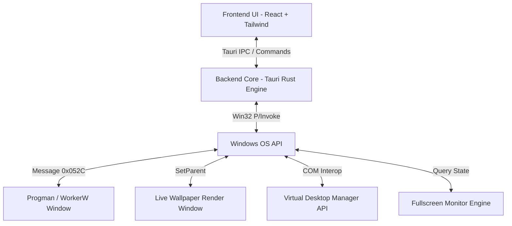

# SYSTEM ARCHITECTURE DOCUMENTATION: PAPER DESKTOP

## 1. TỔNG QUAN HỆ THỐNG (SYSTEM OVERVIEW)
**Paper Desktop** là ứng dụng Windows Desktop cho phép thiết lập và quản lý hình nền tĩnh/Live Wallpaper (Video) riêng biệt cho từng Virtual Desktop (Desktop ảo) trên Windows 10/11 với hiệu năng tối ưu.

---

## 2. CHỌN CÔNG NGHỆ (TECH STACK)

| Thành phần | Công nghệ / Thuật toán | Lý do lựa chọn |
|---|---|---|
| **Desktop Shell** | **Tauri (v2)** | Siêu nhẹ (~15MB RAM), bảo mật, khởi động nhanh hơn Electron. |
| **Backend Core** | **Rust (`windows-rs` / Win32 API)** | Tương tác Win32 API trực tiếp, hiệu năng cao, kiểm soát RAM tuyệt đối. |
| **Frontend UI** | **React + Tailwind CSS + Lucide** | Giao diện hiện đại, linh hoạt, hỗ trợ Glassmorphism / Windows 11 Fluent Design. |
| **Video Rendering Engine** | **DirectShow / Media Foundation / libmpv** | Render mượt mà, hỗ trợ giải mã phần cứng GPU (Hardware Acceleration). |

---

## 3. WIN32 API INTEGRATION SPECIFICATION

### 3.1. Live Wallpaper Injection via WorkerW (0x052C)
Để vẽ Live Wallpaper bên dưới Desktop Icons, ứng dụng thực hiện các bước:
1. Gửi Message bí mật `0x052C` tới cửa sổ hệ thống `Progman` bằng `SendMessageTimeout`.
2. Hệ thống Windows tạo ra một cửa sổ tên `WorkerW` nằm ngay sau `SysListView32` (nơi chứa icon desktop).
3. Sử dụng `SetParent(hwndLiveWallpaper, hwndWorkerW)` để đưa Cửa sổ Render Video làm con của `WorkerW`.

### 3.2. Virtual Desktop Detection & Management
- Sử dụng COM API `IVirtualDesktopManager` và undocumented Virtual Desktop API (`IVirtualDesktopManagerInternal`) để:
  - Lấy danh sách GUID của tất cả Virtual Desktop đang active.
  - Lắng nghe sự kiện chuyển đổi Desktop (`OnCurrentVirtualDesktopChanged`).
  - Map mỗi Virtual Desktop GUID với một Wallpaper Configuration tương ứng.

### 3.3. Performance & Resource Management (Auto-Pause)
- **Fullscreen Detection**: Định kỳ kiểm tra hoặc nhận sự kiện WinEvent `EVENT_SYSTEM_FOREGROUND` để xác định ứng dụng đang active.
- **Tối ưu hóa GPU/CPU**:
  - Nếu ứng dụng active đang ở chế độ Fullscreen (`SHQueryUserNotificationState` trả về `QUNS_BUSY` hoặc `QUNS_RUNNING_D3D_FULL_SCREEN`), phát lệnh `Pause()` tới Render Engine.
  - Khi quay lại bình thường: Phát lệnh `Resume()`.
  - Mute hoàn toàn âm thanh của Video mặc định để không ảnh hưởng đến âm thanh hệ thống.

---

## 4. LUỒNG DỮ LIỆU & STATE MANAGEMENT

1. **Khởi động**: Rust Engine đọc file cấu hình `config.json` -> Khởi tạo WorkerW listener.
2. **Chuyển Desktop**: Event listener phát hiện Desktop `ID_2` active -> Rust Engine ẩn Cửa sổ Wallpaper `ID_1`, hiển thị Cửa sổ Wallpaper `ID_2`.
3. **Thay đổi Wallpaper**: Frontend gửi command `set_wallpaper(desktop_id, file_path)` -> Rust Engine cập nhật state & reload Render Engine.
